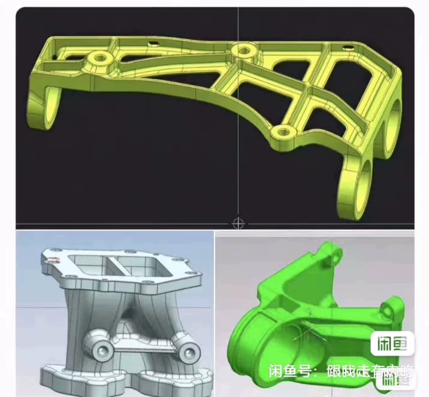
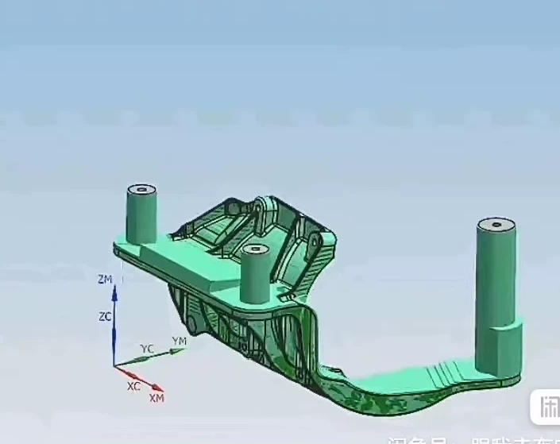
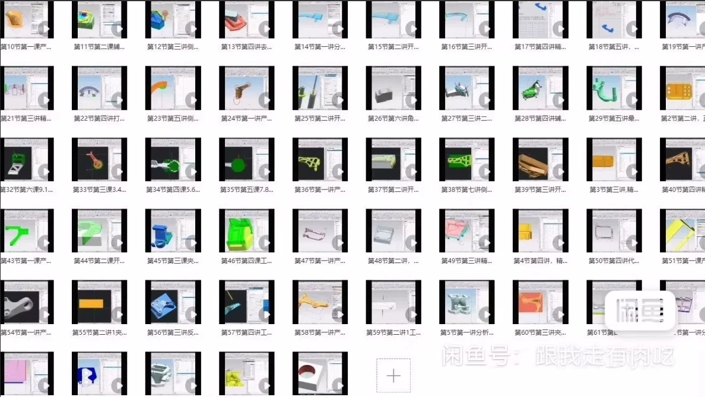
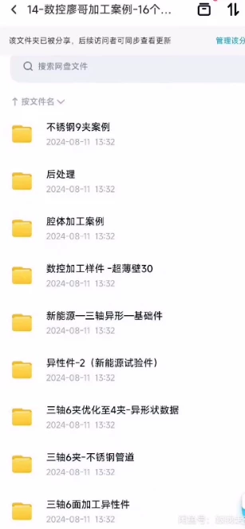

# CNC Liao Brothers Workshop 3-Axis 18-Jig Case Study:

## Body

CNC Liao Brothers Workshop 3-axis 18-jig case study

CNC Liao Brothers workshop 3-axis eighteen clamps case

The materials are complete.
UGNX advanced techniques for complex thin-wall parts 3-axis 18-jaw 6G size, with practical case studies and illustrations! 15 practical cases.

[image] [image] Please note: If you believe that I have infringed upon your rights, please notify me immediately to remove the content.
The item marked "2" is a modest reward for organizing this material, intended solely for the benefit of fellow enthusiasts.

The buyer respects the intellectual property rights of the original author and publisher, supports the original author and publisher, thank you.

Virtual goods, send via cloud storage.

## Images

## Payment

Here is a pay link on Stripe ( https://buy.stripe.com/3cs8yP7sY87d0vu9AB ). Please contact me lonlonago@foxmail.com after funding $89, and I will send you a complete data files , thank you!

